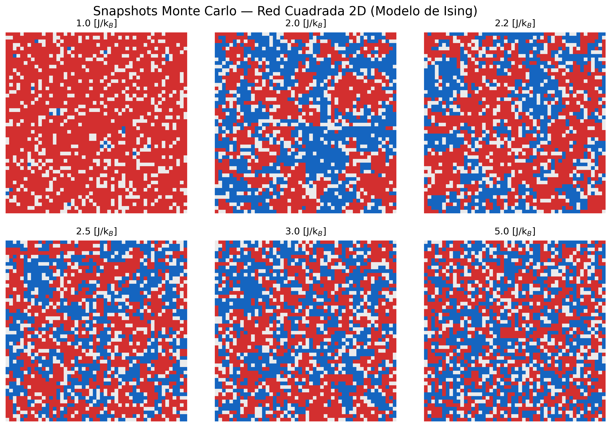
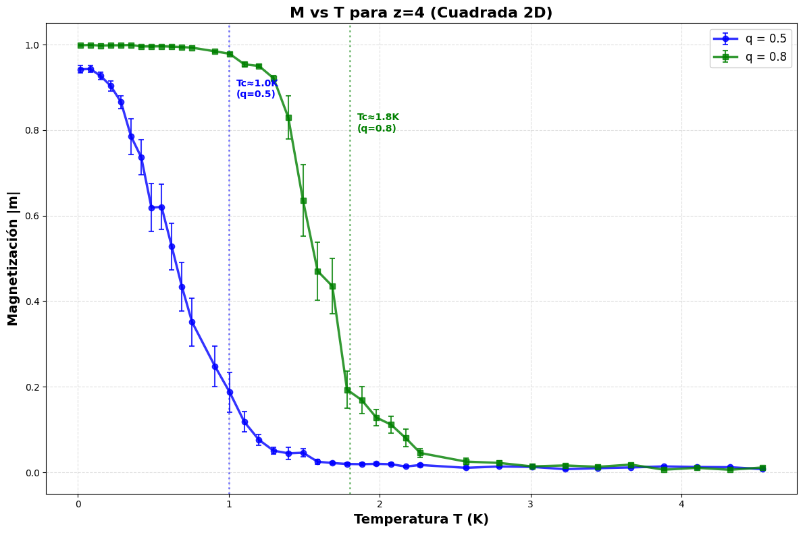
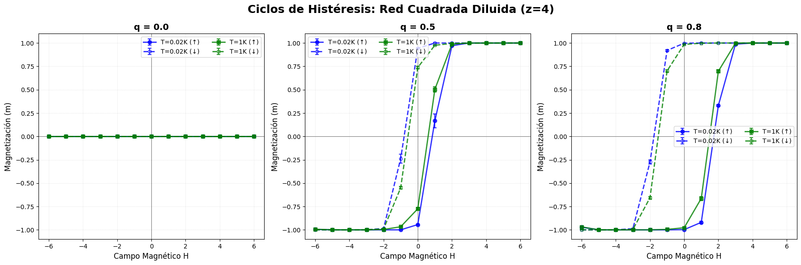
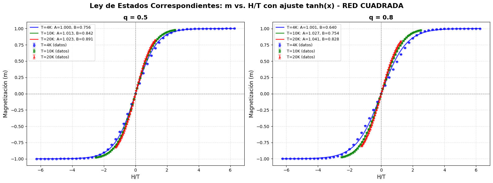

# Computational Study of the Ising Model in Diluted Lattice Geometries

[](https://www.python.org/)
[](https://numba.pydata.org/)
[](LICENSE)
[](https://jupyter.org/)

A comparative theoretical and computational investigation of the ferromagnetic **Ising Model** on site-diluted lattices across different spatial dimensions and coordination geometries ($1\text{D}$ linear chain, $2\text{D}$ honeycomb, $2\text{D}$ square, and $3\text{D}$ simple cubic). Simulations are performed using a single-spin flip **Metropolis Monte Carlo** algorithm with **Numba JIT** acceleration and multi-core parallel sampling.

---

## Overview

The Ising model is a fundamental paradigm in statistical mechanics for studying phase transitions and critical phenomena in magnetic systems. This repository investigates how lattice dimensionality, coordination number $z$, and random site dilution $q$ influence:

- **Thermal order-disorder phase transitions** and critical temperatures $T_c$.
- **Magnetic hysteresis dynamics** under swept external fields $H$.
- **Domain pattern formation** and equilibrium spin configurations.
- **Energy relaxation dynamics** toward stationary equilibrium states.
- **Universal scaling / corresponding-states behavior** in $m(H, T)$ magnetizations.

---

## Physical Model

### Hamiltonian with Site Dilution

The system is described by the site-diluted Ising Hamiltonian with an external magnetic field $H$:

$$\mathcal{H} = -J \sum_{\langle i, j \rangle} \eta_i \eta_j s_i s_j - H \sum_{i} \eta_i s_i$$

where:
- $s_i \in \{-1, +1\}$ denotes the Ising spin orientation at lattice site $i$.
- $\eta_i \in \{0, 1\}$ represents the site occupation variable, governed by the occupation probability $\langle \eta_i \rangle = q \in (0, 1]$. The parameter $q$ controls the degree of non-magnetic site dilution ($q = 1$ corresponds to the pure non-diluted lattice).
- $J > 0$ is the nearest-neighbor exchange coupling constant (ferromagnetic coupling).
- $H$ is the external magnetic field.
- $\langle i, j \rangle$ indicates summation restricted to nearest-neighbor lattice pairs.

---

## Monte Carlo Method

### Metropolis Algorithm

Equilibrium thermodynamic properties and transient dynamics are computed using the Metropolis Monte Carlo (MMC) algorithm:

1. A random occupied lattice site $i$ ($\eta_i = 1$) is selected.
2. A trial spin flip $s_i \to -s_i$ is proposed.
3. The local energy change $\Delta E$ is evaluated:
   $$\Delta E = 2 s_i \left( J \sum_{j \in \text{nn}(i)} \eta_j s_j + H \right)$$
4. The flip is accepted with probability:
   $$P(\text{accept}) = \min\left(1, \exp\left(-\frac{\Delta E}{k_B T}\right)\right)$$

### Implementation & Acceleration

- **Boundary Conditions**: Periodic boundary conditions (PBC) are implemented across all lattice dimensions to minimize finite-size edge effects.
- **Numba JIT Acceleration**: Numba JIT compilation (`@njit`) is used to compile the core Monte Carlo sweep loops to native code for efficient execution.
- **Parallelization**: Independent disorder realizations and temperature sweeps are parallelized using `joblib`.

---

## Lattice Geometries & Critical Reference Values

The project evaluates four lattice topologies characterized by distinct coordination numbers $z$:

| Geometry | Spatial Dim. ($d$) | Coordination ($z$) | Exact / Theoretical $k_B T_c / J$ (Pure $q=1$) | Transition Type |
| :--- | :---: | :---: | :---: | :--- |
| **Linear Chain** | $1\text{D}$ | 2 | $T_c = 0$ | No finite-$T$ phase transition |
| **Honeycomb Lattice** | $2\text{D}$ | 3 | $\frac{2}{\ln(2 + \sqrt{3})} \approx 1.519$ | Second-order phase transition |
| **Square Lattice** | $2\text{D}$ | 4 | $\frac{2}{\ln(1 + \sqrt{2})} \approx 2.269$ | Second-order phase transition |
| **Simple Cubic** | $3\text{D}$ | 6 | $\approx 4.51$ (Numerical estimate) | Second-order phase transition |

> **Theoretical Notes**:
> - **1D Chain ($T_c = 0$)**: The short-range 1D Ising model does not exhibit a ferromagnetic phase transition at finite temperature because domain walls cost finite energy ($\Delta E = 4J$) while gaining infinite configurational entropy in the thermodynamic limit. *(Note: This $1\text{D}$ result is due to finite domain-wall energy and should not be confused with the Mermin–Wagner theorem, which strictly applies to continuous $O(N)$ symmetries with $N \ge 2$.)*
> - **Reference Values ($q=1$)**: The listed $T_c$ values correspond to the pure, non-diluted lattice ($q=1$). As site dilution increases ($q < 1$), the effective transition temperature and magnetic saturation decrease monotonically across the simulated dilution concentrations ($q = 1.0, 0.8, 0.5$).

---

## Computational Experiments & Key Results

### 1. Spatial Spin Configurations & Domain Formation

In 2D systems, Monte Carlo snapshots illustrate the thermal order-disorder transition: below $T_c$, large ferromagnetically aligned spin domains form, whereas above $T_c$, thermal fluctuations destroy long-range magnetic ordering.


*Figure 1: Monte Carlo spin snapshots for the 2D square lattice ($z=4$) across temperatures $T < T_c$, $T \approx T_c$, and $T > T_c$.*

### 2. Thermal Magnetization & Dilution Effects

Temperature sweeps of the average absolute magnetization $|m|(T)$ reveal the sharp drop near $T_c$ characteristic of second-order phase transitions. Random site dilution ($q < 1$) lowers both the saturation magnetization and the transition temperature $T_c$.


*Figure 2: Thermal magnetization $|m|$ vs $T$ for the 2D square lattice under varying site dilution probabilities $q$.*

### 3. Magnetic Hysteresis Loops

Under sweeping external magnetic fields $H$, the system exhibits non-zero coercive fields and remanent magnetizations at temperatures below $T_c$. Increased thermal energy or site dilution reduces the area of the hysteresis loop.


*Figure 3: Hysteresis cycles $m(H)$ for the 2D square lattice ($z=4$) comparing different site dilution rates $q$ and temperatures.*

### 4. Corresponding-States Behavior

In paramagnetic regimes or high-temperature limits, magnetization curves collapse onto hyperbolic tangent profiles $m \approx A \tanh(B \cdot H / T)$, demonstrating empirical collapse and parameterized agreement with hyperbolic tangent $\tanh(x)$ functional profiles in high-temperature / paramagnetic regimes.


*Figure 4: Law of corresponding states fit $m$ vs $H/T$ using $\tanh(x)$ for the diluted 2D square lattice.*

---

## Repository Contents

```
Ising_Model/
├── notebooks/
│   ├── ising_lineal.ipynb      # 1D Linear Chain simulation (z=2)
│   ├── ising_honeycomb.ipynb   # 2D Honeycomb Lattice simulation (z=3)
│   ├── ising_cuadrada.ipynb    # 2D Square Lattice simulation (z=4)
│   └── ising_cubica.ipynb      # 3D Simple Cubic Lattice simulation (z=6)
├── figures/                    # Exported plot figures for README
│   ├── spin_domains_square_lattice.png
│   ├── magnetization_vs_temperature_square.png
│   ├── hysteresis_square_lattice.png
│   └── corresponding_states_square.png
├── Articulo.pdf                # Research article (Spanish version)
├── Ising_English_Version.pdf   # Research article (English version)
├── requirements.txt            # Dependency specification
├── LICENSE                     # MIT License
└── README.md                   # Project documentation
```

### Direct Notebook Links

- [1D Linear Chain Notebook](notebooks/ising_lineal.ipynb)
- [2D Honeycomb Lattice Notebook](notebooks/ising_honeycomb.ipynb)
- [2D Square Lattice Notebook](notebooks/ising_cuadrada.ipynb)
- [3D Simple Cubic Lattice Notebook](notebooks/ising_cubica.ipynb)

### Research Papers

- [Articulo.pdf (Spanish)](Articulo.pdf)
- [Ising_English_Version.pdf (English)](Ising_English_Version.pdf)

---

## Reproducibility & Installation

### Prerequisites

- Python 3.8+
- `pip` package manager

### Environment Setup

1. **Clone the repository**:
   ```bash
   git clone https://github.com/dassjoss/Ising_Model.git
   cd Ising_Model
   ```

2. **Create and activate a virtual environment** (optional but recommended):
   ```bash
   python3 -m venv venv
   source venv/bin/activate  # On Windows: venv\Scripts\activate
   ```

3. **Install dependencies**:
   ```bash
   pip install -r requirements.txt
   ```

4. **Launch Jupyter Notebook**:
   ```bash
   jupyter notebook
   ```

---

## References

1. E. Ising, *"Beitrag zur Theorie des Ferromagnetismus"*, Zeitschrift für Physik **31**, 253–258 (1925).
2. L. Onsager, *"Crystal Statistics. I. A Two-Dimensional Model with an Order-Disorder Transition"*, Physical Review **65**, 117–149 (1944).
3. K. Binder & D. W. Heermann, *Monte Carlo Simulation in Statistical Physics: An Introduction*, Springer (2010).

---

## Author

**Jose Ortiz**  
Instituto de Física — Universidad de Antioquia (UdeA)  
GitHub: [@dassjoss](https://github.com/dassjoss)
